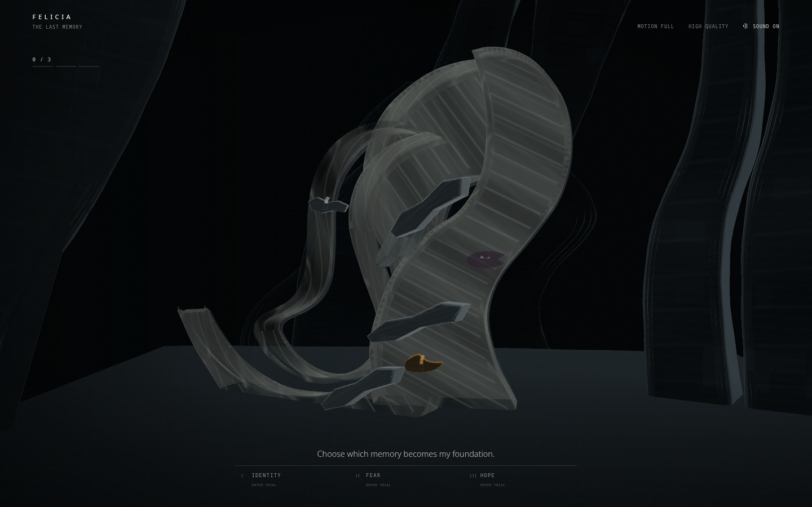

# FELICIA: The Last Memory



> Recover the final memories of a dying AI—and decide which part of her consciousness survives.

FELICIA: The Last Memory is an immersive 3D narrative set inside the final surviving archive
of a dying artificial intelligence. Visitors recover Identity, Fear, and Hope in any order.
Their choices reshape the chamber and determine which memory becomes the foundation of
FELICIA's reconstructed consciousness.

**Live demo:** <https://felicia-the-last-memory.ayx1.chatgpt.site>

**Source:** <https://github.com/Sombra-1/felicia-the-last-memory>

**Hackathon:** 3D Websites Hackathon

## The experience

The visitor enters one continuous field of dark memory strata. FELICIA is not a person,
robot, creature, or floating core: she is an unstable sculptural fold whose silhouette,
balance, motion, internal rhythm, and material response change after every trial. Identity
imposes exact pleating, Fear compresses the same field into shelter and damage, and Hope
opens that material into navigable distance.

After all three memories are recovered, the visitor deliberately begins reconstruction. The
world collapses, recalls the memories in the chosen order, and reforms around the first
selection:

- **Identity first:** ordered, mirrored, architectural, and cold.
- **Fear first:** defensive, fractured, watchful, but alive.
- **Hope first:** open, ascending, warm, and unresolved.

The ending is not a score or collectible summary:

> You did not recover my memory. You decided which part of me survived.

## Why it is original

The visitor's interaction order is part of the narrative rather than a menu choice. The same
three memories become a configuration language for FELICIA's reconstructed consciousness:
the first establishes the foundation, the second changes its motion and structure, and the
third leaves the final accent or scar.

Every visible 3D form and every sound is generated procedurally. The project uses no imported
models, textures, music, or sound files.

## Visual and interaction highlights

- One continuous laminated world built from custom extruded profiles and procedural relief.
- An original asymmetric FELICIA sculpture made from living membrane, internal nickel
  braces, embedded consequence seams, and one unresolved aperture.
- Three physical states of the same material field rather than disconnected levels.
- Six valid memory orders mapped to three major ending profiles.
- A whole-world inversion where the floor rises into the first memory’s governing law.
- Guided pointer, touch, and keyboard interaction—no WASD or free-roaming controls.
- Procedural Web Audio that follows fragment, order, reconstruction stage, and ending.
- Responsive camera framing and calibrated quality tiers for desktop and mobile.
- Reduced-motion choreography, accessible HTML controls, focus coordination, and live status.
- In-place deterministic replay without reloading the page.

## Technology

- React 19, TypeScript, and Vite
- Three.js, React Three Fiber, Drei, and React Three Postprocessing
- GSAP for authored timelines
- Zustand for the explicit experience state machine
- Native Web Audio API for the complete procedural soundscape
- Vitest, React Testing Library, and Playwright
- ESLint and Prettier

## Architecture

The normal interface and 3D runtime remain separate. Zustand owns the experience phase,
collection order, accessibility preferences, quality tier, and audio lifecycle. Central
coordinators author fragment, reconstruction, camera, focus, and sound transitions instead of
distributing timers through scene components.

```text
src/
├── accessibility/  Phase-aware focus coordination
├── audio/          Procedural audio engine and lifecycle
├── camera/         Guided responsive camera choreography
├── environment/    Chamber architecture, lighting, and atmosphere
├── experience/     Canvas boundary and fragment runtime
├── fragments/      Identity, Fear, and Hope geometry
├── reconstruction/ Ending profiles, timeline, and transformed structures
├── scene/          Scene composition and calibration
├── state/          Explicit experience state machine
├── ui/             Accessible DOM interface and fallbacks
└── tests/          Unit and component coverage
```

Experience flow:

`loading → intro → chamber → fragment sequence → ready → collapse → void → recall → rebuild → reveal → ending → resetting`

## Accessibility

- Native keyboard-operable controls with visible focus.
- Logical focus handoff at stable experience boundaries.
- Live-region status and progress announcements.
- Touch targets sized for mobile use.
- Reduced-motion equivalents that preserve the full narrative.
- Persistent mute state, truthful playback status, and limiter-protected audio levels.
- Accessible WebGL failure explanation and guarded retry.
- System fonts, safe-area insets, and dynamic viewport sizing.

See [ACCESSIBILITY.md](docs/ACCESSIBILITY.md) for the detailed behavior and remaining
physical-device checks.

## Performance

Phase 9 renders at 23–30 draw calls and 60,454–70,604 triangles across the measured desktop
and mobile states. The scene uses three active lights, zero shadow maps, capped device pixel
ratio, no decorative particle field, and no model, texture, font, or audio asset payload.

See [PERFORMANCE.md](docs/PERFORMANCE.md) for measured state and bundle data.

## Local setup

Requires Node.js 20.19 or newer.

```bash
git clone https://github.com/Sombra-1/felicia-the-last-memory.git
cd felicia-the-last-memory
npm ci
npm run dev
```

Create a production build:

```bash
npm run build
npm run preview
```

No environment variables, service credentials, backend, or API keys are required.

## Testing

```bash
npm test
npm run test:visual:chromium
npm run test:visual:cross-browser
npm run lint
npm run format:check
npm run build
```

Chromium and Firefox are covered by Playwright. WebKit could not be launched on the release
Linux host because required system libraries were unavailable, so Safari/WebKit remains a
documented physical-device check.

Detailed commands and coverage are in [TESTING.md](docs/TESTING.md) and
[CROSS-BROWSER-TESTING.md](docs/CROSS-BROWSER-TESTING.md).

## Documentation

- [Visual direction](docs/VISUAL-DIRECTION.md)
- [Phase 9 final design system](docs/art-direction/phase9/FINAL-DESIGN-SYSTEM.md)
- [Interaction design](docs/INTERACTION-DESIGN.md)
- [Reconstruction design](docs/RECONSTRUCTION-DESIGN.md)
- [Audio design](docs/AUDIO-DESIGN.md)
- [Accessibility](docs/ACCESSIBILITY.md)
- [Performance](docs/PERFORMANCE.md)
- [Asset attribution](docs/ASSET-ATTRIBUTION.md)
- [Deployment](docs/DEPLOYMENT.md)
- [Devpost draft](docs/DEVPOST-SUBMISSION.md)

## Assets and licenses

All 3D artwork, animation, materials, particles, and Web Audio synthesis were authored
procedurally in this repository. System fonts are used. No external 3D models, textures,
audio recordings, or generated visual assets are included. Open-source libraries retain
their own licenses and are listed in [ASSET-ATTRIBUTION.md](docs/ASSET-ATTRIBUTION.md).

## Project status

Phase 9 — Ultra Cinematic Final Release is feature-frozen. Its complete walkthrough,
85-second trailer, final production frames, performance measurements, and browser validation
live under `docs/evidence/phase9/final`.
