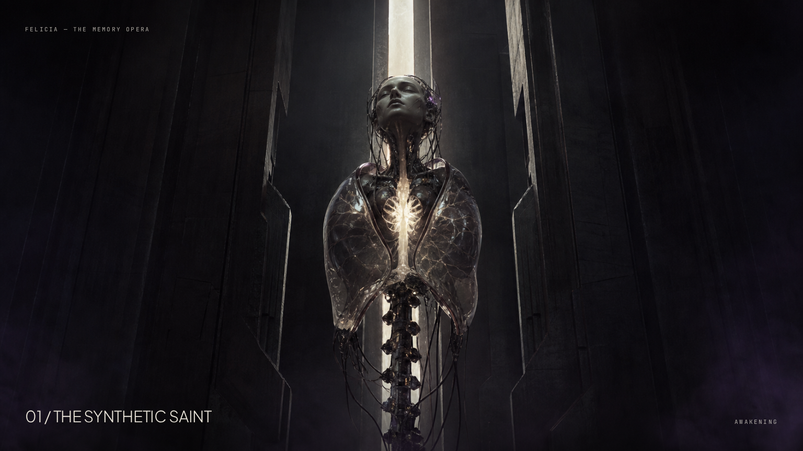
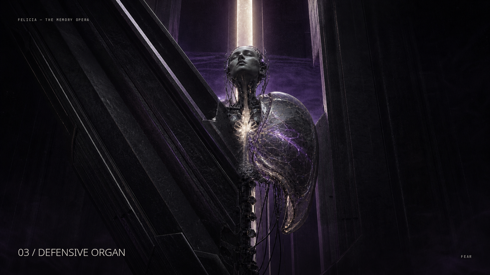
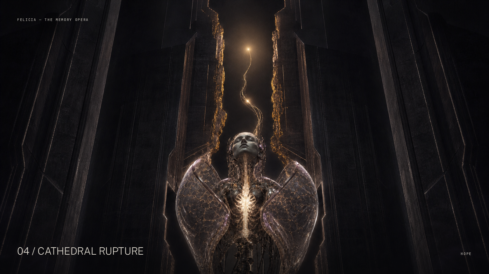
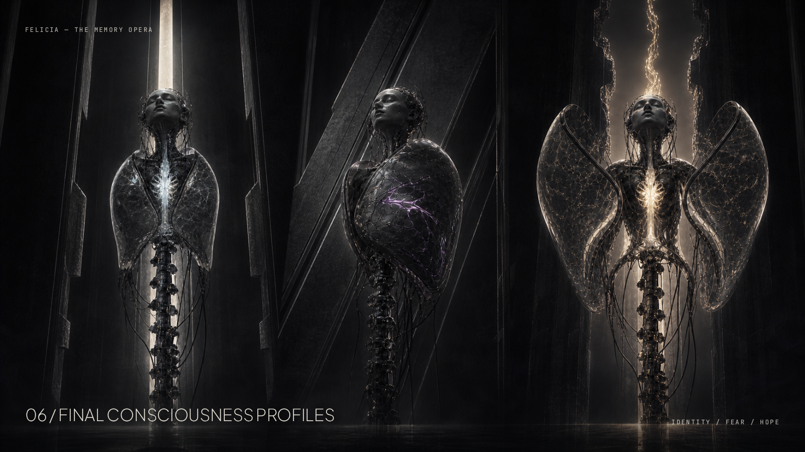

# FELICIA Phase 8 — The Memory Opera

Status: **Style-frame approval gate — no production implementation authorized**

Superdesign canvas:
[FELICIA Phase 8 — The Memory Opera](https://superdesign.dev/teams/5ba66275-3910-41ed-a6c0-597262828fcc/projects/b27c3ad0-b568-4799-ae41-b4de666261f0?live=1)

## 1. One-sentence visual thesis

> FELICIA is a living artificial consciousness suspended inside a monumental black
> memory cathedral; her body is reconstructed from translucent glass organs, neural
> light, metallic anatomy, scars, and fragments of sacred machine architecture.

The cathedral is imposed structure, containment, memory, judgment, and the system
that created her. FELICIA is consciousness, resistance, adaptation, fear,
self-creation, and survival.

## 2. Material bible

Only four material families may appear. Difference comes from form, light, state, and
behavior—not from adding more shaders.

### Black cathedral stone-metal

**Narrative function:** imposed structure and judgment.

**Physical read**

- Near-black stone fused with brushed gunmetal.
- Monumental mass, broad planes, deep bevels, and a subtle vertical grain.
- Low reflectivity; most faces remain dark.
- Narrow grazing light reveals scale and edge thickness.
- Never becomes a forest of thin rods, arches, ribs, or repeated frames.

**Motion**

- Moves only when the cathedral exerts force or responds to FELICIA.
- Large pieces anticipate, accelerate with weight, decelerate, and lock.
- One architectural vector dominates each transformation.

**Shader target**

- Shared instanced material with a slow anisotropic/brushed response.
- Roughness variation is broad and quiet.
- No constant edge glow; the lighting reveals edges.

### Translucent memory glass

**Narrative function:** FELICIA’s organs and the physical substance of memory.

**Physical read**

- Thick-edged, imperfect, layered glass with smoke inside the volume.
- Visible front and rear surfaces.
- Restrained refraction and slow fake-caustic drift.
- Surface thickness remains readable against black.
- Never behaves like a thin alpha plane or featureless transparent bubble.

**Motion**

- Breath, compression, opening, healing, and controlled deformation.
- Deformation originates at an anatomical joint, wound, or material propagation front.
- Shells reach clear sealed, guarded, exposed, and opened rest poses.

**Shader target**

- Fresnel plus thickness proxy, internal gradient, low-frequency distortion, and
  profile-controlled caustic motion.
- No indiscriminate expensive transmission.

### Neural light

**Narrative function:** directed consciousness and player agency.

**Physical read**

- Hairline to tendon-width energy inside or immediately connected to anatomy.
- Starts, travels, branches, and settles with direction and purpose.
- Cold ivory while dormant; memory color appears only during activation.
- Bloom is local and restrained.

**Motion**

- Identity: exact pulses and decisive locks.
- Fear: interrupted travel, compression, and defensive contraction.
- Hope: continuous branching and upward unfolding.
- Reconstruction: sequential, unequal ignition based on memory order.

**Shader target**

- Directional flow along authored curves with a short fading wake.
- Flow speed and pulse width respond directly to interaction state.
- Never becomes a random scene-wide line network.

### Scar material

**Narrative function:** permanent consequence.

**Physical read**

- Embedded seam within glass, tissue, or metal.
- Identity scar is silver and stabilizing.
- Fear scar is violet with a near-black red undertone and interrupted edges.
- Hope scar is antique gold and creates openings or branching growth.
- Scars are visible without floating over the body.

**Motion**

- Propagates through the actual surface.
- Can spread, stabilize, heal, or open.
- Every trial return ends with the scar/material becoming part of FELICIA’s silhouette
  or internal anatomy.

**Shader target**

- Shared signed-distance or UV propagation mask.
- One state uniform controls dormant, spreading, active, and settled phases.

## 3. Color script

| Phase          | Dominant colors                                    | Emotional purpose                        | Saturation rule                         |
| -------------- | -------------------------------------------------- | ---------------------------------------- | --------------------------------------- |
| Awakening      | `#030405`, `#090a0c`, `#e8e3d8`, trace `#34263b`   | Discovery, awe, judgment                 | Withhold almost all color               |
| Identity       | `#171b1e`, `#9ca6ac`, `#dbe7ea`, `#f2f5f3`         | Imposed order, cold precision            | Extremely low                           |
| Fear           | `#030405`, `#4b285b`, `#8d5ba0`, `#210c13`         | Compression, survival, cost              | Color stays inside threat/scar paths    |
| Hope           | `#030405`, `#b58a42`, `#f0dfbc`, `#6f425f`         | Self-creation, release, vertical opening | Gold follows one living route           |
| Reconstruction | Almost colorless, then order-weighted memory color | Irreversible formation                   | First memory 60%, second 25%, third 15% |

The final image must never read as silver, violet, and gold mixed equally. The first
memory owns the body’s dominant organ system, light behavior, posture, and cathedral
response. The second alters behavior; the third completes one distinct detail.

## 4. Lighting script

### Awakening: first ten seconds

| Time      | Light event                                       | Visual information revealed                           |
| --------- | ------------------------------------------------- | ----------------------------------------------------- |
| 0.0–1.2s  | Full darkness                                     | Nothing; sound and anticipation lead                  |
| 1.2–2.1s  | One cold ivory internal pulse                     | Sternum and heart-organ only                          |
| 2.1–3.8s  | Narrow vertical grazing shaft                     | Impossible cathedral scale                            |
| 3.8–5.4s  | Breath catches glass thickness                    | FELICIA becomes living anatomy                        |
| 5.4–6.8s  | Reflected response moves through one nave surface | Cathedral reacts to her                               |
| 6.8–8.4s  | Three memory wounds reveal sequentially           | Choice becomes spatial and anatomical                 |
| 8.4–10.0s | Light settles                                     | Synthetic Saint hero composition; instruction appears |

No full chamber reveal occurs before the camera and light settle.

### Identity

- One hard centered axial source.
- Mirrors increase precision as alignment improves.
- Incorrect state creates offset reflected brightness, not decorative fracture lines.
- Completion produces one brief white-silver lock, then settles colder and calmer.

### Fear

- Hard lateral warning light originates from the active threat direction.
- Foreground defense interrupts the beam.
- A single ivory rim preserves the heart and face.
- Impact compresses light into the contacted organ; violet remains under the surface.
- No full-screen flash or uniform purple lift.

### Hope

- Warm light begins inside FELICIA’s crack, never from a generic external lamp.
- It travels upward through the one guided neural route.
- Cold cathedral faces separate around the living light.
- Completion widens the gradient and negative space instead of adding more emitters.

### Reconstruction

- Start under an intimate, almost colorless anatomical work light.
- Each memory system ignites sequentially and unequally.
- The body changes before the cathedral receives the new light.
- Rebirth is the only full-scene exposure transformation.
- The final rest state retains shadow depth; it is not a uniformly bright victory shot.

## 5. Six cinematic style frames

Overview:
[`phase8-style-frame-contact-sheet-revised.png`](./phase8-style-frame-contact-sheet-revised.png)

### 01 — The Synthetic Saint

- **Hero:** FELICIA’s face, sternum, glass organ-shell, and living heart.
- **Interaction target:** the first internal pulse.
- **Dominant environmental gesture:** one vertical aperture revealing scale.
- **Camera:** distant low monumental frame, settled after one push.
- **Approval proof:** FELICIA reads immediately and architecture does not compete.

### 02 — Imposed Symmetry

- **Hero:** FELICIA under forced bilateral order.
- **Interaction target:** the broken silver vertebral axis inside her.
- **Dominant environmental gesture:** two cathedral walls hinge into mirror faces.
- **Camera:** exact centered perspective and axial stop.
- **Approval proof:** Identity is a conflict inside the same cathedral, not a loaded
  mirror mini-game.
- **Gate revision:** exactly three separated vertebral blocks now form the target;
  the displaced middle block, inward-canted mirror walls, compressed organ lobes,
  and converging reflections make alignment and physical pressure explicit.

### 03 — Defensive Organ

- **Hero:** FELICIA’s asymmetric survival posture.
- **Interaction target:** the exposed seam behind the growing shield organ.
- **Dominant environmental gesture:** one black shutter becomes one living defense.
- **Camera:** off-axis, compressed, partially occluded.
- **Approval proof:** Fear reads through anatomy and pressure rather than three
  rectangular shield choices.

### 04 — Cathedral Rupture

- **Hero:** FELICIA opening and growing upward.
- **Interaction target:** the warm seed traveling along one neural path.
- **Dominant environmental gesture:** her internal crack splits the cathedral above.
- **Camera:** rising curve with widening negative space.
- **Approval proof:** Hope is growth against containment, not a field of gold rods.

### 05 — Anatomy-First Reconstruction

- **Hero:** the exposed interior of FELICIA.
- **Interaction target:** the ivory synchronization node at the sternum.
- **Dominant environmental gesture:** recognizable memory organs physically reinsert.
- **Camera:** intimate close-up after traveling inside the opened shell.
- **Approval proof:** the body itself is the climax; order weighting is visible as
  60/25/15 rather than equal tricolor streams.
- **Gate revision:** one exposed ivory synchronization node and three legible docking
  collars organize the frame; silver foundation, violet modifier, and gold
  completion organ communicate 60/25/15 through scale, area, and light priority.

### 06 — Final Consciousness Profiles

- **Identity-first:** narrow, sealed, mirrored, exact.
- **Fear-first:** guarded, asymmetric, scarred, compressed.
- **Hope-first:** open, expanded, vertically escaping.
- **Approval proof:** profile is legible from silhouette and posture before color.

## 6. Complete transition storyboard

The existing `TransitionDirector` remains the future authority. The implementation
must expose a small set of continuous state values—architecture fold, glass phase,
scar propagation, neural flow, camera travel, and light travel—rather than mounting
and hiding unrelated scene trees.

### A. Darkness → Synthetic Saint

1. Black frame holds.
2. Internal sternum pulse reveals only FELICIA.
3. The pulse reaches the cathedral floor through one narrow reflection.
4. A vertical stone-metal aperture opens enough to reveal scale.
5. FELICIA inhales; the aperture moves by a few centimeters in response.
6. Three dormant memory wounds brighten sequentially in the architecture.
7. Camera completes one controlled push and settles.
8. Concise choice instruction reveals through a mask.

**Continuity:** FELICIA’s pulse causes every subsequent reveal.

### B. Chamber → Identity

1. The selected silver wound stabilizes into a vertical scar.
2. Its propagation crosses the chamber floor toward FELICIA’s sternum.
3. Two broad cathedral walls rotate inward; their interior stone surface gradually
   becomes imperfect mirror glass.
4. FELICIA’s shell is pulled toward exact bilateral alignment.
5. The camera moves only along the central axis and passes through one mirror surface.
6. The reflected FELICIA becomes the trial’s depth system.
7. A broken silver vertebral section inside her separates into the three alignment
   beats.
8. Camera stops; reflected fracture remains; input unlocks.

**Dominant gesture:** convergence toward the central axis.

### C. Identity → Chamber

1. Final vertebral segment aligns with one decisive material lock.
2. Reflections collapse into the real body from farthest to nearest.
3. Mirror glass loses reflectivity and becomes black cathedral stone-metal again.
4. The locked silver vertebra contracts into FELICIA’s permanent internal spine.
5. Camera crosses back through the same surface along the inverse axis.
6. Light settles on the new spine before the choice view returns.

**Return cargo:** recognizable silver spine, not a generic silver stream.

### D. Chamber → Fear

1. The selected violet wound darkens the surrounding stone.
2. A lateral warning light travels across the nave ahead of the camera.
3. One cathedral shutter pivots between camera and FELICIA.
4. As it passes, its inner edge becomes thick memory glass and attaches to her
   vulnerable lobe.
5. The camera is forced off-axis by the shutter’s path.
6. Remaining architecture compresses inward along the same diagonal.
7. The first shutdown wave becomes visible beyond the shutter opening.
8. Defensive organ reaches its guarded rest pose; input unlocks.

**Dominant gesture:** diagonal compression and interception.

### E. Fear → Chamber

1. Final impact deforms the active organ and arrests the incoming pressure plane.
2. Violet energy remains trapped beneath its glass surface.
3. Cathedral shutter releases, but the attached anatomical section does not.
4. The organ folds tighter around FELICIA and becomes a permanent protective plate.
5. The impact line heals into one embedded scar.
6. Camera returns along a constrained offset path, never snapping to center.
7. The chamber reopens around the changed silhouette.

**Return cargo:** the actual curved defensive organ and embedded violet scar.

### F. Chamber → Hope

1. The selected gold wound opens as a hairline crack in the cathedral floor.
2. Warm neural light travels from the wound into FELICIA’s heart.
3. It exits the sternum as one guided filament and moves ahead of the camera.
4. The camera follows a rising curve rather than orbiting.
5. The filament reaches the aperture and physically splits two cathedral masses.
6. Existing black surfaces peel back; their exposed glass edges become Hope’s organic
   gates.
7. A single warm seed becomes the guided interaction target.
8. The opened architecture reaches a quiet rest pose; input unlocks.

**Dominant gesture:** one upward crack becoming one living path.

### G. Hope → Chamber

1. The final gate opens and stays physically deformed.
2. The warm seed returns along the player-authored neural path.
3. Gates fold inward sequentially, becoming layered glass tissue around the path.
4. The entire path contracts into one branching gold organ.
5. The organ inserts through FELICIA’s sternum and opens the upper shell.
6. Cathedral masses return but retain a visible vertical separation.
7. Camera descends and settles on the widened breathing silhouette.

**Return cargo:** the authored gold neural branch and permanent upper opening.

### H. Chamber → Reconstruction exposure

1. Choice UI and nonessential light disappear.
2. Camera approaches FELICIA’s face and sternum.
3. The outer glass shell anticipates, separates at anatomical seams, and opens.
4. Camera travels through the opened shell.
5. Cathedral falls into near-black depth.
6. A narrow work light reveals the internal organ arrangement.
7. Persistent memory organs loosen at their real joints.
8. Synchronization interaction appears only after the close-up settles.

**Dominant gesture:** exposure by anatomical opening.

### I. Synchronization

1. First memory organ is largest and closest to its insertion point.
2. Second and third remain smaller and less illuminated.
3. Player hold stabilizes pulse timing and reduces physical tremor.
4. Material flow advances through visible channels.
5. Alignment changes the angle and seating of each recognizable organ.
6. Audio harmony and internal illumination resolve together.
7. Release interrupts flow without resetting the physical progress already earned.
8. Completion locks the synchronization node and begins formation.

**Direct response:** pulse, alignment, flow, illumination, and sound all follow the
same synchronization value.

### J. Foundation → modification → completion

1. The first memory constructs the dominant organ system and owns approximately 60%
   of the final light/material language.
2. The second memory changes how that system moves, breathes, guards, or opens.
3. The third inserts one final distinct detail and owns approximately 15%.
4. Shell thickness and posture update around the new anatomy.
5. Scars settle under the surface.
6. The body breathes once in its new profile before the environment reacts.

**Dominant gesture:** anatomy builds from inside outward.

### K. Rebirth → final consciousness

1. FELICIA’s new heart pulse crosses the entire body.
2. One full-scene exposure shift begins at her and reaches the cathedral.
3. Cathedral masses align, compress, or split according to the first memory profile.
4. Camera exits the shell and begins a controlled pullback.
5. Secondary and final memory traces remain subordinate.
6. Camera reaches one profile-specific iconic composition.
7. All major motion settles.
8. Essential ending text reveals only after silhouette recognition is possible.

**Dominant gesture:** the cathedral changes because FELICIA changed.

### L. Re-enter memory

1. Ending text masks away.
2. Profile light contracts into FELICIA’s heart.
3. Cathedral response reverses without undoing anatomical history until the pulse
   reaches zero.
4. Shell closes to the dormant Synthetic Saint silhouette.
5. Camera returns to darkness, then begins awakening again.

**Continuity:** replay is a controlled ritual reset, not a page reload or hard cut.

## 7. Camera-language guide

| Sequence                | Lens character                    | Movement                                 | Occlusion                       | Required rest pose            |
| ----------------------- | --------------------------------- | ---------------------------------------- | ------------------------------- | ----------------------------- |
| Awakening               | 32–40mm equivalent, monumental    | One slow push                            | FELICIA partly hidden initially | Synthetic Saint hero frame    |
| Chamber choice          | 45–55mm, stable                   | No float; minute breathing response only | Clear organs/wounds             | Readable choice triangle      |
| Identity                | 45–60mm, exact                    | Pure axial dolly                         | Mirror crossing once            | Centered vanishing point      |
| Fear                    | 60–75mm, compressed               | Short off-axis displacement              | One defense crosses foreground  | Guarded three-quarter view    |
| Hope                    | 32–40mm, expanding                | Rising curve                             | Minimal; space opens            | Vertical rupture frame        |
| Reconstruction exposure | 65–90mm macro character           | Intimate push through shell              | Shell edges only                | Sternum synchronization node  |
| Rebirth                 | Begins intimate, resolves 35–45mm | Controlled pullback                      | None across essential anatomy   | Profile-specific poster frame |

Rules:

- No continuous orbit motion.
- Camera may move only for reveal, pressure, pursuit, entry, or consequence.
- Every move has anticipation, travel, deceleration, and a stable endpoint.
- Input unlock follows visual settlement.
- Reduced motion preserves the same shot order using shorter travel and material/light
  propagation rather than skipping the composition.

## 8. Typography and UI hierarchy

The target is at least 30% less interface by persistent element count and occupied
screen area.

### Keep

1. Current goal.
2. One interaction verb.
3. Progress.
4. Chosen order.
5. One essential narrative line.
6. Sound control.

### Remove

- Ambient metadata strings that do not change a decision.
- Persistent archive/integrity/status telemetry.
- Multiple simultaneous phase labels.
- Full-width bottom rails and bordered panels.
- Repeated trial name, mode, and stage labels in separate locations.
- Decorative microcopy over complex geometry.

### Type system

- Human narrative: Avenir Next / Segoe UI Variable / Helvetica, light, 24–34px
  desktop and 20–26px mobile.
- Interaction verb: 14–17px, medium contrast, one stable edge location.
- System language: SFMono / Cascadia Code / Roboto Mono / Consolas, 10–12px tracked
  uppercase.
- Progress: one line or three marks, never a panel.
- Chosen order: three words or anatomical glyphs in one stable location.
- Text enters through a masked reveal only after the camera settles.
- Text never crosses FELICIA’s silhouette or the interaction target.

## 9. Before/after visual comparison

[`before-after-contact-sheet.png`](./before-after-contact-sheet.png)

| Current Phase 7.1                                                  | Phase 8 style-frame target                                                         |
| ------------------------------------------------------------------ | ---------------------------------------------------------------------------------- |
| FELICIA reads as a small abstract procedural object                | FELICIA has a recognizable face, sternum, thick glass organs, posture, and breath  |
| Many fragments, lines, columns, controls, and targets share weight | One hero, one target, one environmental gesture                                    |
| Cathedral is assembled from repeated thin modules                  | Cathedral is defined by a few monumental stone-metal masses                        |
| Identity is planes, pickets, axes, and a detached nucleus          | The same cathedral walls become mirrors while FELICIA’s spine is forced into order |
| Fear is a core plus symmetrical shield objects                     | One cathedral shutter materially becomes one asymmetric living defense             |
| Hope is a forest of rods, gates, and line paths                    | One internal crack becomes one neural route and opens the cathedral                |
| Reconstruction is a distant body surrounded by colored streams     | Camera enters the body; recognizable organs detach and physically reinsert         |
| Endings rely heavily on color and surrounding structures           | Identity, Fear, and Hope are readable from silhouette and posture                  |
| UI frames the scene continuously                                   | Artwork owns the frame; typography appears only after settlement                   |

## 10. Elements to remove or consolidate

This is the removal budget for implementation. At least 40% of decorative geometry
groups must be removed or consolidated before new geometry is considered.

### Chamber

- Remove repeated ceiling-beam ladders.
- Consolidate lateral column arrays into two to four monumental masses.
- Remove decorative floor rings and radial guide lines.
- Remove orbiting fragment rings and generic circular portal frames.
- Replace detached fragment props with three living wounds/organs embedded in the
  cathedral.
- Remove nonessential floating labels and object-linked line callouts.

### FELICIA

- Remove orbit cages and line loops around the body.
- Remove any shell lobe that does not contribute to sealed, guarded, exposed, or open
  silhouette states.
- Consolidate small internal rods into one readable sternum and a few vertebral joints.
- Remove floating consequence symbols; consequences exist only inside anatomy.

### Identity

- Remove corridor picket-plane repetition.
- Remove detached diamond/ball target geometry.
- Remove free-floating axis lines not rooted in FELICIA’s spine.
- Retain two monumental mirror walls, restrained reflection depth, and one broken
  vertebral target.

### Fear

- Remove the three equal shield-button objects as visual props.
- Remove spherical impact bubbles and generic rings.
- Remove symmetrical defensive repetition.
- Retain one directionally transformed shutter/organ per beat, one pressure plane, one
  vulnerable seam, and permanent scar tissue.

### Hope

- Remove the gold rod forest.
- Remove simultaneous gate repetition.
- Remove unrelated particle columns and line tangles.
- Retain one crack, one guided neural path, one seed, and sequential shell openings
  grown from the same material.

### Reconstruction

- Remove repeated cathedral arches and crown structures.
- Remove equal silver/violet/gold streams.
- Remove generic particle convergence and floating light cores.
- Remove any foreground architecture crossing essential anatomy.
- Retain shell edges, recognizable organs, the synchronization node, one work light,
  and the final order-driven cathedral response.

### Endings

- Remove profile labels as the primary differentiator.
- Remove surrounding stick, blade, and tower arrays that compensate for weak anatomy.
- Retain only architecture needed to align, compress, or open the final negative space.

### Interface

- Remove at least one third of persistent metadata elements.
- Remove full-width bordered control surfaces.
- Remove duplicated progress and phase indicators.
- Keep one narrative line, one verb, one progress expression, chosen order, and sound.

## Style-frame human art-direction checklist

These answers assess the proposed frames, not the unimplemented production build.

- **Does the first frame look like authored digital art?** Yes. It has one designed
  silhouette, one light event, monumental scale, and controlled withholding.
- **Is FELICIA immediately the hero?** Yes. Her face, sternum, heart, and thick glass
  organs own the highest contrast and clearest silhouette.
- **Is there one clear visual idea per scene?** Yes: revelation, imposed symmetry,
  defensive interception, upward rupture, anatomical reinsertion, and irreversible
  profile.
- **Has decorative geometry been reduced?** Yes in the frames. The package also names
  the specific production geometry that must be deleted or consolidated.
- **Do transitions visibly transform materials and structures?** The storyboard does.
  Each passage has one shared geometry/material gesture and explicit return cargo.
- **Is the reconstruction anatomy-first?** Yes. The close-up makes the actual organs,
  joints, insertion points, scars, and order weighting the entire spectacle.
- **Are final profiles recognizable in silhouette?** Yes. Closure, asymmetric armor,
  and vertical opening remain legible without relying on color.
- **Does the climax surpass every trial?** In the proposed composition, yes: it changes
  camera scale, exposes unprecedented detail, rebuilds the body, and reserves the only
  full-scene lighting transformation for rebirth.
- **Would one frame work as a poster?** Yes. The Synthetic Saint and final profile
  study both remain clear at contact-sheet scale.
- **Does anything still look like an engineer placed primitives in a scene?** Not in
  these style frames. The main implementation risk is reducing the mirror walls,
  shutter, and cathedral masses to thin boxes; their mass, bevel, material thickness,
  and light response are therefore hard requirements.

## Approval gate

Production implementation remains blocked until a human explicitly approves these six
frames as one coherent world.

Questions for approval:

1. Is the synthetic face and elongated organ-body the correct permanent FELICIA
   silhouette?
2. Do the four materials feel sufficiently coherent and distinctive?
3. Does each trial read as a conflict with the same cathedral?
4. Is the anatomy-first reconstruction direction strong enough to define the climax?
5. Are the three final profiles distinct enough without labels or color?

No Phase 8 production code should change before these answers are approved.
