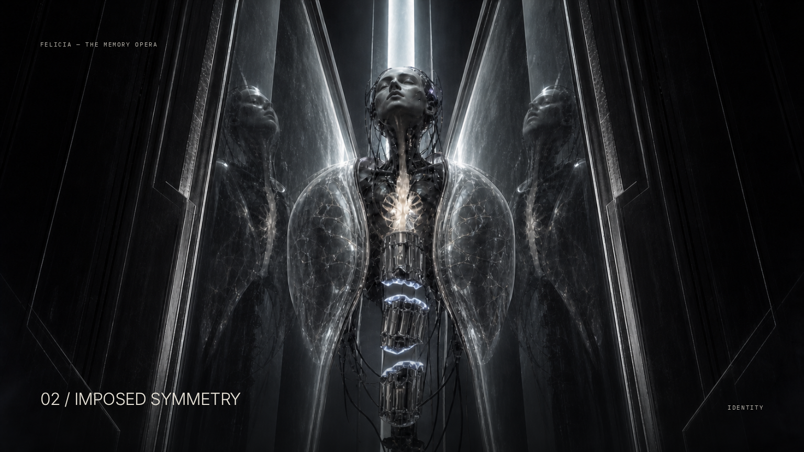
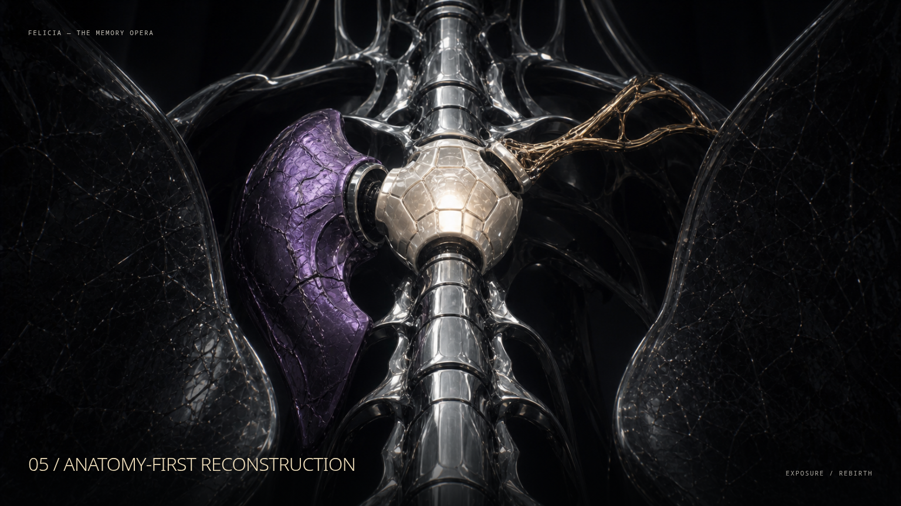

# Phase 8 — Option 2 gate revisions

Only Frames 02 and 05 were revised. Frames 01, 03, 04, and 06 remain unchanged.
No production implementation was started.

## Revised Frame 02 — Imposed Symmetry

- The active target is now exactly three large vertebral blocks with two open
  fracture gaps. The displaced, rotated middle block makes the required alignment
  readable at a glance.
- Both mirror-cathedral walls cant inward and visibly compress FELICIA's glass organ
  lobes. The few retained reflections converge toward the sternum, clarifying forced
  bilateral alignment without adding visual noise.
- Silver fracture light is confined to the broken faces, so the vertebral target
  remains anatomical rather than becoming a generic glowing interface.

## Revised Frame 05 — Anatomy-First Reconstruction

- One faceted ivory synchronization node is now the unmistakable focal target.
  Three exposed docking collars give each memory organ a clear insertion point.
- The memory hierarchy is communicated through physical scale and luminance: the
  silver vertebral foundation carries approximately 60% of the visual weight, the
  curved violet defensive organ 25%, and the small gold neural completion 15%.
- Competing wires, tiny branches, and decorative components were removed. Broad
  anatomy, dark negative space, and three separated insertion paths now control the
  close-up.

## Updated approval sheet

The revised frames preserve the approved FELICIA identity, four-material system,
memory cathedral, camera language, and series continuity.
